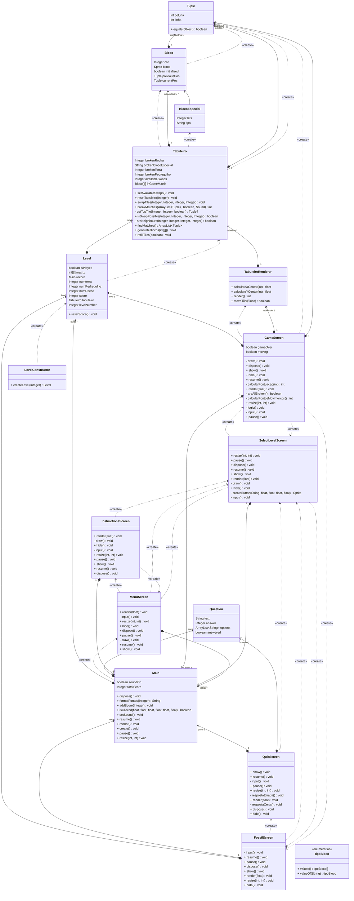

```mermaid
classDiagram
direction BT
class Bloco {
   Integer cor
   Sprite bloco
   boolean initialized
   Tuple previousPos
   Tuple currentPos
}
class BlocoEspecial {
   Integer hits
   String tipo
}
class FossilScreen {
  - input() void
  + resume() void
  + pause() void
  + dispose() void
  + show() void
  + render(float) void
  + resize(int, int) void
  + hide() void
}
class GameScreen {
  - draw() void
  + dispose() void
  + show() void
  + hide() void
  + resume() void
  - calcularPontuacao(int) int
  + render(float) void
  - areAllBroken() boolean
  - calcularPontosMovimentos() int
  + resize(int, int) void
  - logic() void
  - input() void
  + pause() void
   boolean gameOver
   boolean moving
}
class InstructionsScreen {
  + render(float) void
  - draw() void
  + hide() void
  - input() void
  + resize(int, int) void
  + pause() void
  + show() void
  + resume() void
  + dispose() void
}
class Level {
  + resetScore() void
   boolean isPlayed
   int[][] matriz
   Main record
   Integer numterra
   Integer numPedregulho
   Integer numRocha
   Integer score
   Tabuleiro tabuleiro
   Integer levelNumber
}
class LevelConstructor {
  + createLevel(Integer) Level
}
class Main {
  + dispose() void
  + formatPontos(Integer) String
  + addScore(Integer) void
  + isClicked(float, float, float, float, float, float) boolean
  + setSound() void
  + resume() void
  + render() void
  + create() void
  + pause() void
  + resize(int, int) void
   boolean soundOn
   Integer totalScore
}
class MenuScreen {
  + render(float) void
  - input() void
  + resize(int, int) void
  + hide() void
  + dispose() void
  + pause() void
  - draw() void
  + resume() void
  + show() void
}
class Question {
   String text
   Integer answer
   ArrayList~String~ options
   boolean answered
}
class QuizScreen {
  + show() void
  + resume() void
  - input() void
  + pause() void
  + resize(int, int) void
  - respostaErrada() void
  + render(float) void
  - respostaCerta() void
  + dispose() void
  + hide() void
}
class SelectLevelScreen {
  + resize(int, int) void
  + pause() void
  + dispose() void
  + resume() void
  + show() void
  + render(float) void
  - draw() void
  + hide() void
  - createButton(String, float, float, float, float) Sprite
  - input() void
}
class Tabuleiro {
  + setAvailableSwaps() void
  + resetTabuleiro(Integer) void
  + swapTiles(Integer, Integer, Integer, Integer) void
  + breakMatches(ArrayList~Tuple~, boolean, Sound) int
  - getTopTile(Integer, Integer, boolean) Tuple?
  + isSwapPossible(Integer, Integer, Integer, Integer) boolean
  - areNeighbours(Integer, Integer, Integer, Integer) boolean
  + findMatches() ArrayList~Tuple~
  + generateBlocos(int[][]) void
  + refillTiles(boolean) void
   Integer brokenRocha
   String brokenBlocoEspecial
   Integer brokenTerra
   Integer brokenPedregulho
   Integer availableSwaps
   Bloco[][] inGameMatrix
}
class TabuleiroRenderer {
  + calculateXCenter(int) float
  + calculateYCenter(int) float
  + render() int
  + moveTile(Bloco) boolean
}
class Tuple {
  + equals(Object) boolean
   int coluna
   int linha
}
class tipoBloco {
<<enumeration>>
  + values() tipoBloco[]
  + valueOf(String) tipoBloco
}

Bloco "1" *--> "previousPos 1" Tuple 
Bloco  ..>  Tuple : «create»
BlocoEspecial  -->  Bloco 
FossilScreen "1" *--> "level 1" Level 
FossilScreen "1" *--> "game 1" Main 
FossilScreen  ..>  QuizScreen : «create»
FossilScreen  ..>  SelectLevelScreen : «create»
GameScreen  ..>  FossilScreen : «create»
GameScreen "1" *--> "level 1" Level 
GameScreen "1" *--> "game 1" Main 
GameScreen  ..>  SelectLevelScreen : «create»
GameScreen  ..>  TabuleiroRenderer : «create»
GameScreen "1" *--> "tabRender 1" TabuleiroRenderer 
GameScreen  ..>  Tuple : «create»
GameScreen "1" *--> "toBreak *" Tuple 
InstructionsScreen "1" *--> "game 1" Main 
InstructionsScreen  ..>  MenuScreen : «create»
InstructionsScreen  ..>  SelectLevelScreen : «create»
Level "1" *--> "tabuleiro 1" Tabuleiro 
Level  ..>  Tabuleiro : «create»
LevelConstructor  ..>  Level : «create»
Main "1" *--> "levels *" Level 
Main  ..>  MenuScreen : «create»
Main "1" *--> "questions *" Question 
MenuScreen  ..>  InstructionsScreen : «create»
MenuScreen "1" *--> "game 1" Main 
MenuScreen  ..>  SelectLevelScreen : «create»
QuizScreen "1" *--> "game 1" Main 
QuizScreen "1" *--> "question 1" Question 
QuizScreen  ..>  SelectLevelScreen : «create»
SelectLevelScreen  ..>  FossilScreen : «create»
SelectLevelScreen  ..>  GameScreen : «create»
SelectLevelScreen "1" *--> "game 1" Main 
SelectLevelScreen  ..>  MenuScreen : «create»
Tabuleiro  ..>  Bloco : «create»
Tabuleiro "1" *--> "inGameMatrix *" Bloco 
Tabuleiro  ..>  BlocoEspecial : «create»
Tabuleiro "1" *--> "toBreak *" Tuple 
Tabuleiro  ..>  Tuple : «create»
TabuleiroRenderer "1" *--> "tabuleiro 1" Tabuleiro
```
